# TriviaForge

A real-time, interactive trivia game platform built with Socket.IO, designed for educators, event organizers, and trivia enthusiasts.

<!-- Screenshot Placeholder: Landing Page -->
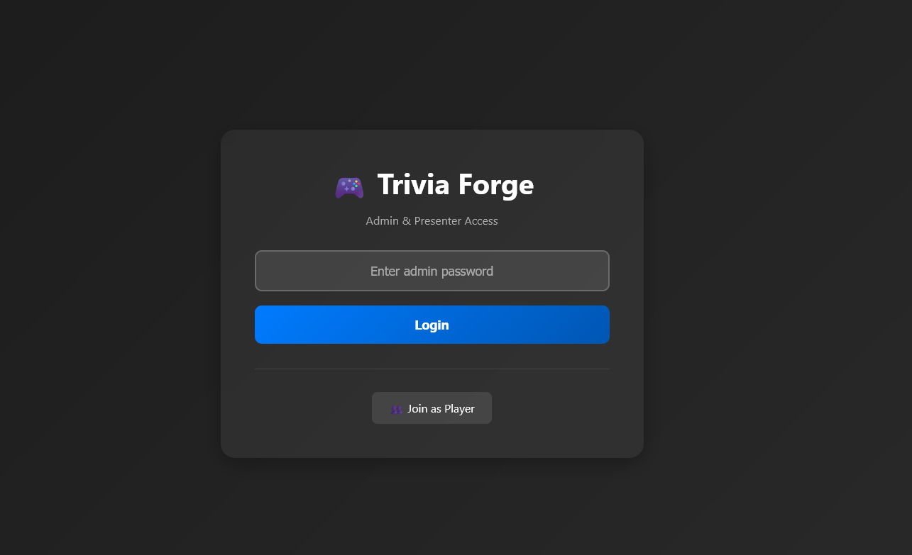

<!-- Screenshot Placeholder: Main Game Interface -->
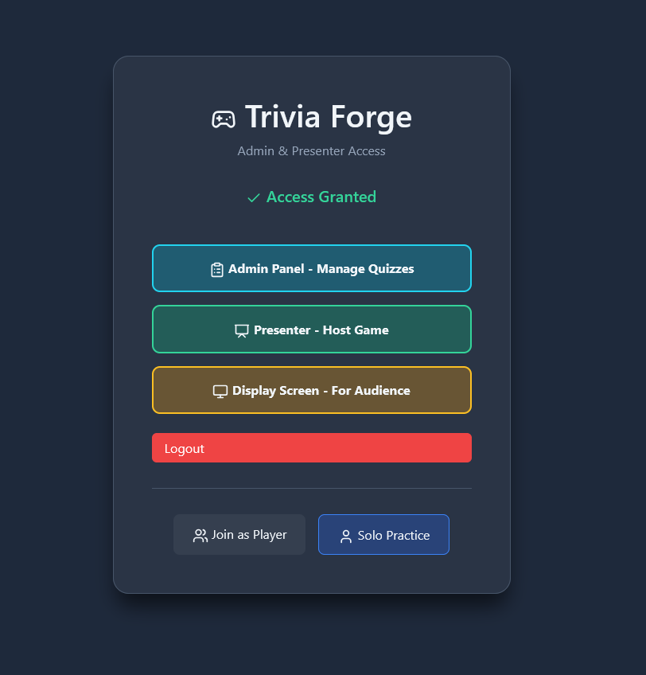

## Features

### For Administrators
- **Quiz Management**: Create, edit, and delete custom quizzes with an intuitive interface
- **Excel Import**: Bulk import quizzes from professionally formatted Excel templates (supports 2-10 answer choices)
- **Session Management**: Resume interrupted sessions with full state preservation
- **Real-time Monitoring**: Track active rooms and player participation live

<!-- Screenshot Placeholder: Admin Dashboard -->
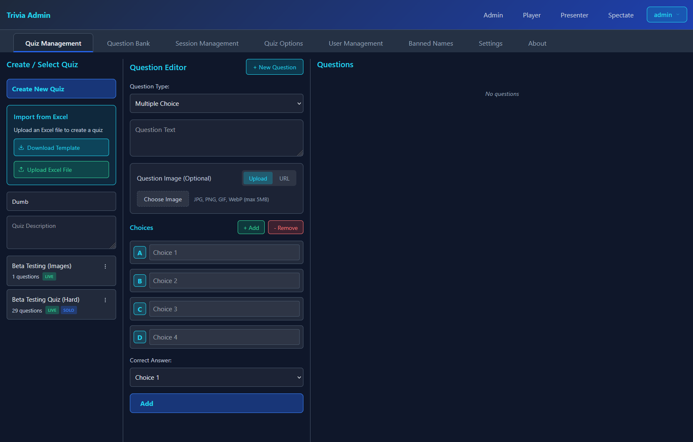

### For Presenters
- **Live Quiz Control**: Present questions, reveal answers, and navigate through quizzes in real-time
- **Player Management**: See connected players with live status indicators
- **QR Code Generation**: Quick player join via scannable QR codes
- **Session Resume**: Continue interrupted quizzes exactly where you left off
- **Multi-room Support**: Manage multiple concurrent trivia sessions

<!-- Screenshot Placeholder: Presenter View -->
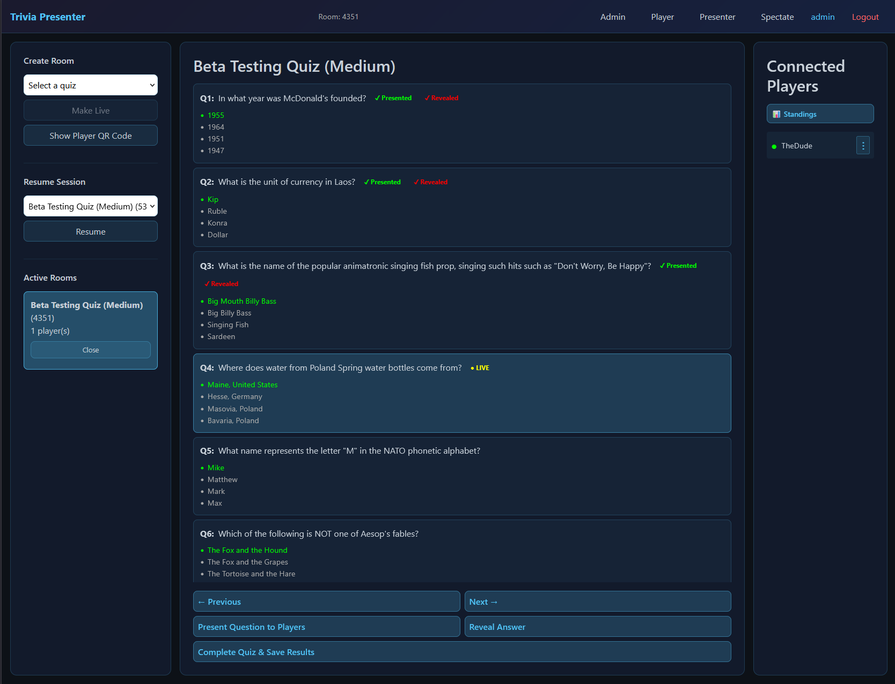

### For Players
- **Mobile-Optimized Interface**: Responsive design that works seamlessly on all devices
- **Real-time Feedback**: Instant answer submission and result display
- **Answer Locking**: Prevents re-answering after submission (even on reconnection)
- **Reconnection Support**: Automatically restore progress when rejoining
- **Progress Tracking**: Visual indicators for answered questions

<table>
  <tr>
    <td width="33%" align="center">
      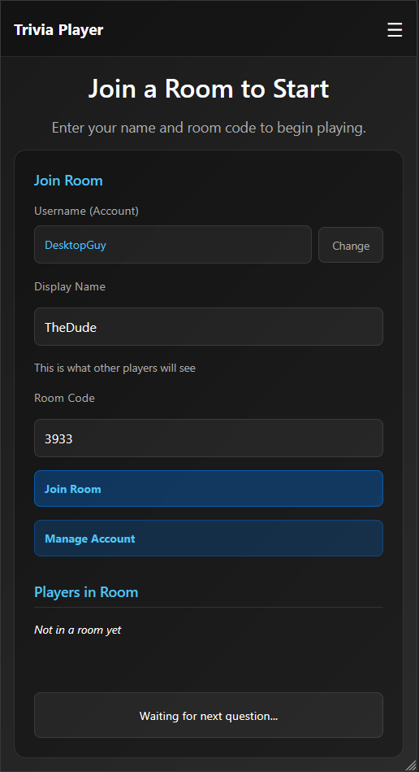
      <br/>
      <em>Waiting for Question</em>
    </td>
    <td width="33%" align="center">
      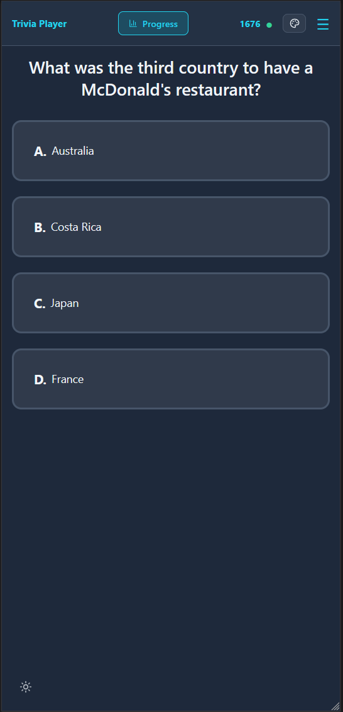
      <br/>
      <em>Answering Questions</em>
    </td>
    <td width="33%" align="center">
      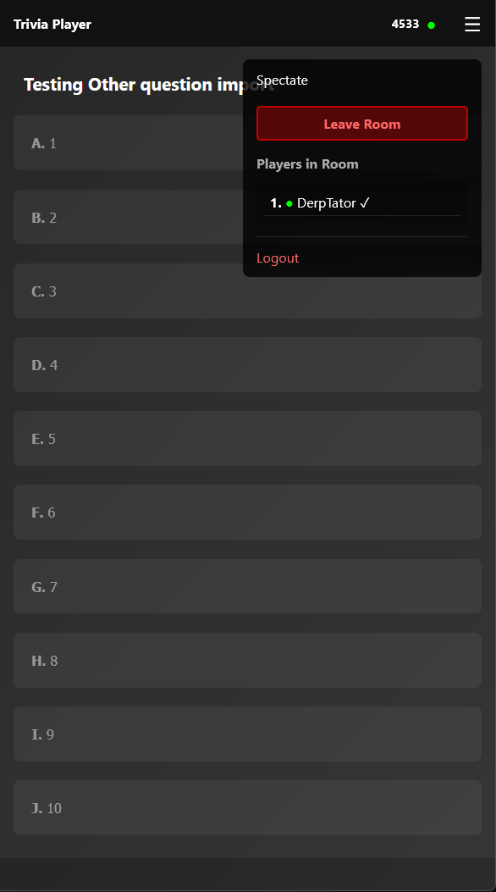
      <br/>
      <em>Interface Overview</em>
    </td>
  </tr>
</table>

### For Spectators
- **Display Mode**: Large-screen view perfect for projectors and TVs
- **Live Results**: Real-time answer distribution and statistics
- **Reveal Animations**: Engaging answer reveals with visual feedback

<!-- Screenshot Placeholder: Display/Spectator View -->
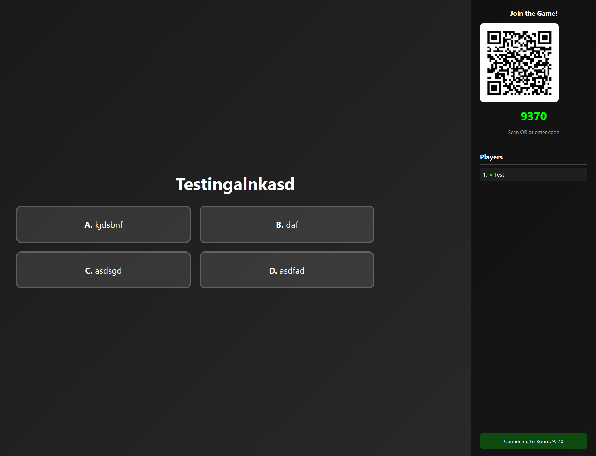

## Technology Stack

- **Backend**: Node.js, Express.js, Socket.IO
- **Frontend**: Vanilla JavaScript, HTML5, CSS3
- **Excel Processing**: ExcelJS, XLSX, Multer
- **Real-time Communication**: WebSocket (via Socket.IO)
- **Data Storage**: JSON file-based system

## Installation

### Prerequisites
- Node.js (v14 or higher)
- npm (v6 or higher)

### Setup Instructions

1. **Clone the repository**
   ```bash
   git clone git@github.com:EmanTemplar/TriviaForge.git
   cd TriviaForge
   ```

2. **Install dependencies**
   ```bash
   cd app
   npm install
   ```

3. **Configure environment variables**

   Create a `.env` file in the `app` directory (use `.env.example` as a template):
   ```bash
   cp .env.example .env
   ```

   Edit the `.env` file with your configuration:
   ```env
   # Server Configuration
   APP_PORT=3000                    # Port for the application (default: 3000)

   # Admin Security
   ADMIN_PASSWORD=your_secure_password_here

   # Network Configuration (Optional)
   HOST_IP=192.168.1.100           # Your server's IP address
   SERVER_URL=http://localhost:3000 # Full server URL (overrides HOST_IP if set)
   ```

4. **Start the server**
   ```bash
   npm start
   ```

5. **Access the application**
   - Admin Panel: `http://localhost:3000/index.html`
   - Presenter: `http://localhost:3000/presenter.html`
   - Player: `http://localhost:3000/player.html`
   - Display: `http://localhost:3000/display.html`

## Usage Guide

### Creating a Quiz

#### Method 1: Manual Creation (Admin Panel)
1. Navigate to the Admin panel
2. Enter admin password
3. Fill in quiz title and description
4. Add questions with 2-10 answer choices
5. Mark the correct answer for each question
6. Click "Save Quiz"

#### Method 2: Excel Import
1. Download the Excel template from the Admin panel
2. Fill in your quiz data following the template format:
   - Column A: Question text
   - Columns B-K: Answer choices (2-10 choices)
   - Column L: Correct answer index (0-9)
3. Upload the completed Excel file
4. Review and save the imported quiz

<!-- Screenshot Placeholder: Quiz Creation -->
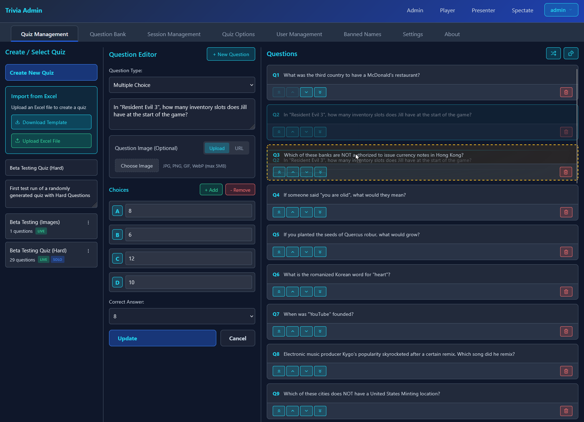

### Running a Live Session

1. **Presenter Setup**
   - Open the Presenter page
   - Select a quiz from the dropdown
   - Click "Make Live" to create a room
   - Share the room code or QR code with players

2. **Player Join**
   - Players open the Player page
   - Enter room code and their name
   - Wait for questions to be presented

3. **Presenting Questions**
   - Navigate through questions using Previous/Next buttons
   - Click "Present Question to Players" to show current question
   - Players submit their answers
   - Click "Reveal Answer" to show correct answer and results

4. **Completing the Session**
   - Click "Complete Quiz & Save Results" to finish
   - Session data is automatically saved

<!-- Screenshot Placeholder: Live Session Flow -->
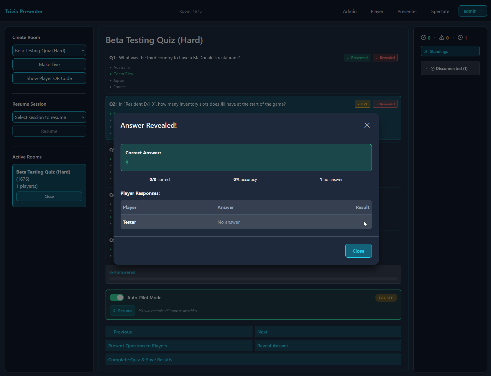

### Resuming an Interrupted Session

If a session is interrupted (server restart, connection loss, etc.):

1. Go to Presenter or Admin page
2. Find the session in "Resume Session" or "Incomplete Sessions" dropdown
3. Click "Resume"
4. A new room code is generated
5. Players rejoin with their **original names** to restore their progress
6. Continue from where you left off

<!-- Screenshot Placeholder: Resume Session -->
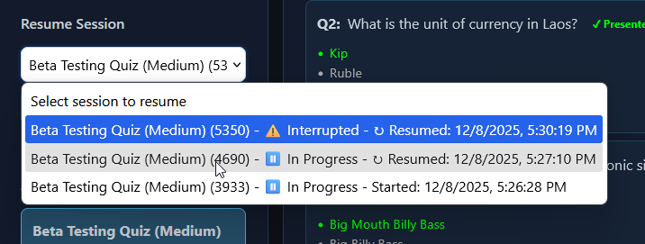

### Viewing Past Sessions

All completed and interrupted sessions are saved and can be reviewed:

1. Navigate to the Admin panel
2. Scroll to the "Completed Sessions" section
3. View session details including:
   - Quiz title and room code
   - Start/resume timestamps
   - Player names and scores
   - Individual question results

<!-- Screenshot Placeholder: Past Sessions -->
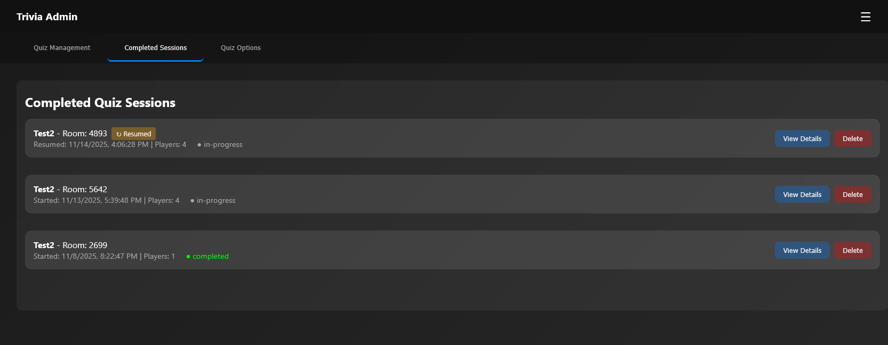

## File Structure

```
TriviaForge/
├── app/
│   ├── public/           # Frontend files
│   │   ├── index.html    # Admin panel
│   │   ├── presenter.html # Presenter interface
│   │   ├── player.html   # Player interface
│   │   ├── display.html  # Spectator/display view
│   │   ├── styles.css    # Shared styles
│   │   └── *.js          # Client-side scripts
│   ├── quizzes/          # Stored quiz JSON files
│   ├── sessions/         # Session state files
│   ├── server.js         # Main server application
│   └── package.json      # Dependencies
├── LICENSE               # PolyForm Noncommercial License
├── CONTRIBUTING.md       # Contribution guidelines
└── README.md            # This file
```

## Environment Variables

| Variable | Description | Default | Required |
|----------|-------------|---------|----------|
| `APP_PORT` | Port number for the server | `3000` | No |
| `ADMIN_PASSWORD` | Password to access admin panel | - | Yes |
| `HOST_IP` | Server IP address for network access | Auto-detected | No |
| `SERVER_URL` | Full server URL (overrides HOST_IP) | `http://{HOST_IP}:{PORT}` | No |

## Features in Detail

### Excel Quiz Import
- Download a formatted Excel template with color-coded sections
- Support for 2-10 answer choices per question
- Automatic validation of quiz structure
- Preserves question formatting and special characters

### Session Management
- Automatic session state saving
- Player answer history preservation
- Reconnection support with progress restoration
- Timestamp tracking for created and resumed sessions
- Status indicators (In Progress, Interrupted, Completed)

### Answer Integrity
- Server-side validation prevents answer manipulation
- Answer locking after submission (persists across disconnects)
- Prevents re-answering after reveal
- Tamper-proof answer tracking

### Responsive Design
- Mobile-first interface for players
- Desktop-optimized admin and presenter views
- Adaptive text sizing with viewport scaling
- Touch-friendly controls

## License

This project is licensed under the **PolyForm Noncommercial License 1.0.0**.

**Key points:**
- ✅ Free for personal use, research, and educational purposes
- ✅ Open source and available for modification
- ✅ Can be used by nonprofits and educational institutions
- ❌ Cannot be used for commercial purposes or profit-making activities

See the [LICENSE](LICENSE) file for full details.

## Contributing

We welcome contributions from the community! Please read our [CONTRIBUTING.md](CONTRIBUTING.md) guide before submitting pull requests.

**Quick guidelines:**
- By contributing, you agree your contributions will be under the same noncommercial license
- Follow the existing code style
- Test your changes thoroughly
- Write clear commit messages
- Update documentation as needed

## Support

- **Issues**: Report bugs via [GitHub Issues](https://github.com/EmanTemplar/TriviaForge/issues)
- **Discussions**: Ask questions and share ideas in [GitHub Discussions](https://github.com/EmanTemplar/TriviaForge/discussions)

## Roadmap

Potential future features (as of Nov. 2025):
- [ ] User authentication and accounts
- [ ] Question media support (images, audio)
- [ ] Leaderboard and scoring systems
- [ ] Timer-based questions
- [ ] Team mode
- [ ] Export results to CSV/PDF
- [ ] Dark mode
- [ ] Internationalization

## Credits

Built with love for educators, event organizers, and trivia enthusiasts.

---

**TriviaForge** - Where Knowledge Meets Fun 🎮
